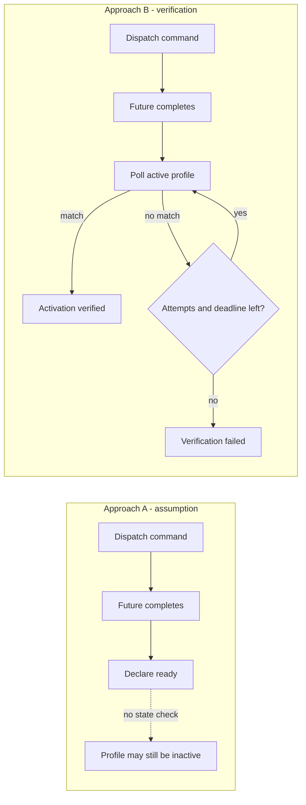

# Async Profile Readiness Demo

[Türkçe açıklama](README_TR.md)

**[Open the live demo](https://ahmetdemirevrensel.github.io/datawedge-async-profile-demo/)**

A small Flutter app that compares two ways of handling an asynchronous command:

- **Approach A:** treat a completed `Future` as proof that the external system is ready.
- **Approach B:** wait for the command `Future`, then verify the observable external state with bounded polling.

> [!IMPORTANT]
> This project does **not** connect to Zebra DataWedge, Zebra hardware, or any company system. It is a deterministic simulation of a general integration problem: a command acknowledgement can complete before an external system reaches the state the application actually needs.

## What the demo shows

Both approaches run with the same selected activation delay:

- 200 ms
- 1500 ms
- 5000 ms
- Never activates

The UI measures events with a real `Stopwatch` and displays separate states for:

- Command dispatched
- Future completed
- Readiness assumed by Approach A
- Profile activation observed in the simulated external service
- Activation verified
- Verification failed / timeout

The result cards also show measured decision data. Approach A records when it
declared readiness and whether the simulated profile was active at that exact
moment. That historical result stays unchanged if the profile activates later.
Approach B shows the verification timestamp and successful polling attempt, or
the timeout timestamp when readiness is never observed.

Selecting another delay automatically clears the previous result. If a run is
still active, its subscriptions and timers are invalidated before the new
scenario is shown, so the selected delay and visible timeline cannot describe
different runs.

## Languages

The interface supports Turkish and English. Turkish is selected by default, and
the `TR / EN` control in the top-right corner changes the complete interface
immediately, including scenario descriptions, status rows, outcome messages,
and timeline events. Changing the language does not reset or alter a running
simulation.

Translations use Flutter's official `gen-l10n` workflow:

- `lib/l10n/app_tr.arb`
- `lib/l10n/app_en.arb`
- `l10n.yaml`

After editing an ARB file, regenerate localization output with:

```bash
flutter gen-l10n
```

The default policy is intentionally visible in the app:

| Setting | Value |
| --- | ---: |
| Simulated command acknowledgement | 40 ms |
| Poll interval | 1000 ms |
| Maximum attempts | 5 |
| Verification deadline | 5000 ms |

At exactly 5000 ms, the verifier performs the final profile query before declaring failure. An activation scheduled exactly on the deadline is accepted.

## Run locally

Requirements:

- Flutter SDK compatible with Dart `^3.12.0`
- Chrome, Android emulator/device, or iOS simulator

```bash
flutter pub get
flutter run -d chrome
```

You can also run it on another Flutter target:

```bash
flutter devices
flutter run -d <device-id>
```

## Run checks

```bash
dart format --output=none --set-exit-if-changed lib test
flutter analyze
flutter test
```

The automated tests cover:

- A command `Future` completing before activation
- Early activation
- Delayed activation with continued polling
- No activation and timeout
- Maximum attempt enforcement
- The 5000 ms activation/deadline boundary
- Both approaches using the same conditions but reporting readiness differently
- Reset cancelling timers and responses from a previous run
- Scenario changes clearing completed results
- Scenario changes cancelling an active run without leaking stale events
- Approach A preserving its decision-time state after later activation
- Dynamic assumption, activation, verification, and timeout measurements
- Turkish and English result fields on mobile and desktop layouts

These tests validate only `FakeProfileService`, the bounded verification policy,
and this demo's UI state. They are not Zebra device tests and do not validate
real DataWedge timing or behavior.

## Project structure

```text
lib/
├── app.dart
├── l10n/
│   ├── app_en.arb
│   ├── app_tr.arb
│   ├── app_localizations_x.dart
│   └── generated/
├── main.dart
└── profile_demo/
    ├── application/
    │   ├── profile_activation_verifier.dart
    │   └── profile_demo_controller.dart
    ├── domain/
    │   ├── profile_service.dart
    │   └── simulation_models.dart
    ├── infrastructure/
    │   └── fake_profile_service.dart
    └── presentation/
        ├── profile_demo_page.dart
        └── widgets/
```

- **Domain** defines simulation states and the profile service contract.
- **Infrastructure** contains `FakeProfileService`, including activation timers and reset isolation.
- **Application** owns the bounded verification policy and comparison flow.
- **Presentation** renders controls, state cards, and the measured timeline.
- **Localization** keeps user-facing Turkish and English text in ARB files;
  application and domain layers store semantic events rather than translated
  sentences.

## Flow comparison



The standalone Mermaid source is available at [`docs/flow-comparison.mmd`](docs/flow-comparison.mmd).

## Demo screenshots

### 1500 ms activation

Approach A assumes readiness before activation. Approach B waits until the
second poll observes the active profile.


### Profile never activates

Approach A still assumes readiness when the command Future completes. Approach
B performs all five polls and reports a timeout at the verification deadline.


## Related Medium article

Article link: **Coming soon**

Replace this placeholder with the published Medium URL after the article is live.

## Technical boundary

This demo proves only the behavior of its own simulation and verification policy. It does not prove:

- Actual DataWedge timing on any Zebra device
- Android broadcast delivery behavior
- Scanner readiness or `SCANNER_STATUS == WAITING`
- Correctness of a real DataWedge profile configuration

Those claims require device measurements and integration tests. The demo exists to make the distinction between **command completion** and **observable readiness** easy to reproduce without proprietary code or hardware.
