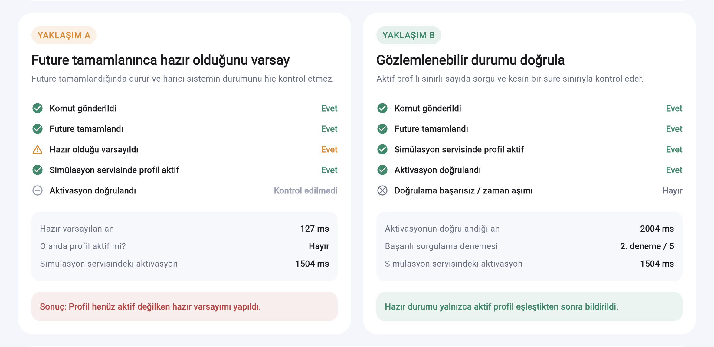
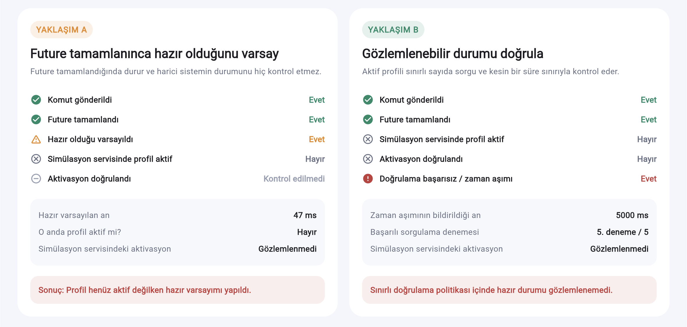

# Asenkron Profil Hazırlık Demosu

[English README](README.md)

**[Canlı demoyu aç](https://ahmetdemirevrensel.github.io/datawedge-async-profile-demo/)**

Bu bağımsız Flutter demosu, bir asenkron komutun `Future` sonucunun tamamlanması
ile harici sistemin gerçekten hazır olması arasındaki farkı gösterir.

> [!IMPORTANT]
> Bu proje Zebra DataWedge'e, Zebra cihazlarına veya herhangi bir şirket
> sistemine bağlanmaz. Yalnızca kontrollü bir asenkron servis simülasyonudur.

## İki yaklaşım

- **Yaklaşım A:** Komut `Future`'ı tamamlandığında profilin hazır olduğunu
  varsayar. Harici durumu sorgulamaz.
- **Yaklaşım B:** `Future` tamamlandıktan sonra aktif profili sınırlı sayıda
  sorgular ve hazır durumunu gözlemleyerek doğrular.

Kartlardaki hazır varsayımı, servis aktivasyonu, doğrulama ve zaman aşımı
süreleri çalışma sırasında gerçek bir `Stopwatch` ile ölçülür. Senaryo
değiştirildiğinde önceki sonuçlar ve timeline temizlenir.

## Çalıştırma

```bash
flutter pub get
flutter run -d chrome
```

## Test ve analiz

```bash
dart format --output=none --set-exit-if-changed lib test
flutter analyze
flutter test
flutter build web
```

## Demo ekran görüntüleri

### 1500 ms aktivasyon

Yaklaşım A profil aktifleşmeden hazır varsayımı yapar. Yaklaşım B ise ikinci
sorguda aktif profili gözlemleyerek doğrulama yapar.



### Profil hiç aktifleşmez

Yaklaşım A komut Future'ı tamamlandığında yine hazır varsayımı yapar. Yaklaşım
B beş sorgunun tamamını çalıştırır ve doğrulama süresi sonunda zaman aşımı
bildirir.



## Teknik sınır

Testler yalnızca `FakeProfileService`, doğrulama politikası ve demo arayüzünün
davranışını doğrular. Gerçek DataWedge zamanlaması, Android broadcast teslimi,
tarayıcı hazırlığı veya gerçek Zebra profil yapılandırması hakkında kanıt
sunmaz.

## Medium makalesi

**[Medium yazısını oku](https://medium.com/@ahmetdemirevrensel01/flutterda-await-tamamland%C4%B1-datawedge-profili-neden-h%C3%A2l%C3%A2-aktif-de%C4%9Fildi-9d447600b692)**
